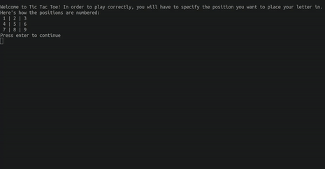
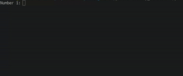
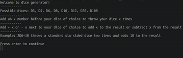
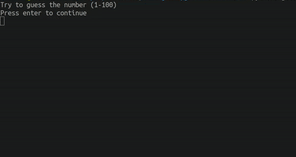
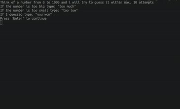

<div id="top"></div>

  <h3 align="center">Mini games</h3>

  <p align="center">
    Some console games made with python!
  </p>
</div>


<!-- TABLE OF CONTENTS -->
<details>
  <summary>Table of Contents</summary>
  <ol>
    <li>
      <a href="#getting-started">Getting Started</a>
      <ul>
        <li><a href="#installation">Installation</a></li>
      </ul>
    </li>
    <li><a href="#games">Games</a></li>
    <li><a href="#usage">Usage</a></li>
    <li><a href="#contact">Contact</a></li>
  </ol>
</details>


<!-- GETTING STARTED -->
## Getting Started

Here is how to make the games run locally.

### Installation

1. Make sure you have python installed in your sytem
2. Clone the repo
   ```sh
   git clone https://github.com/ikolokotronis/mini_games.git
   ```
3. Choose a game you want to run (e.g. tic-tac-toe.py)
4. Open your terminal and type
   ```
   python "game-name.py" (e.g. python tic-tac-toe.py)
   ```
<p align="right">(<a href="#top">back to top</a>)</p>


## Games
#### Tic Tac Toe
The classic Tic Tac Toe game  


#### Lottery simulator
A lottery simulator (to win you have to hit six numbers)  


#### Dice generator
A custom dice roller  


#### Guess the number
A guessing game  


#### Guess the number 2
A guessing game like the previous one but in reverse  
    


<!-- USAGE EXAMPLES -->
## Usage

You could use this as a place to learn more about python (by inspecting the game codes) or just to try out the games.


<p align="right">(<a href="#top">back to top</a>)</p>


<!-- CONTACT -->
## Contact

Ioannis Kolokotronis - ioanniskolokotronis1@gmail.com

Project Link: [https://github.com/ikolokotronis/mini_games]

<p align="right">(<a href="#top">back to top</a>)</p>

